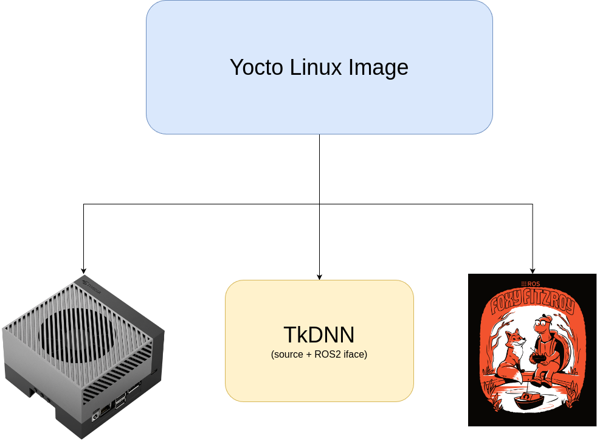

# Overview - Goals and Motivation
This final project aims to be the capstone of the Advanced Embedded Linux Development Specialization. The goal of this project is to roll a custom Linux Image (using Yocto Project) targeting as Hardware an NVIDIA AGX Orin used by [MoReModenaRacing - Driverless Formula Student Team](https://www.moremodenaracing.it/mmr-driverless/) of the [University of Modena and Reggio Emilia (UNIMORE)](https://www.ingmo.unimore.it/it). Unfortunately, since the source code of the Autonomous Driving Pipeline is not Open-Source, this project will _only_ target open-source packages used within the autonomous driving pipeline. The ported packages are the following:

- ROS 2 - Foxy Fitzroy.

- TkDNN (both ROS2 interface and source project).
 
Here's a graph displaying the main Components of the Yocto Image:

    

The expected result is to successfully execute the TkDNN library, displaying inference made on sample videos recorded during test days.

# Target Build System
As mentioned above, the chosen Target Build System is Yocto.

# Hardware Platform
NVIDIA AGX Orin is the chosen HW Platform. There's already a [BSP OE Layer](https://github.com/OE4T/meta-tegra) for the targeted NVIDIA Module. 

# Open Source Projects Used
Here's a list of the Open Source Project used:
- [ROS2 Foxy Fitzroy](https://docs.ros.org/en/foxy/Releases/Release-Foxy-Fitzroy.html)

- [TkDNN](https://github.com/ceccocats/tkDNN)

- [Nvidia Tegra BSP OE Layer](https://github.com/OE4T/meta-tegra)

- [ROS2 OE Layer](https://github.com/ros/meta-ros)

# Previously Discussed Content
There's not any particolar content covered in previous assignments apart from the main topics covered by the introduction to Yocto Course.

# New Content
The planned new contents to be ported are the following:
- Targeting public layers found on OpenEmbedded Layer Index.
- Flashing the custom Linux image on a HW.

# Shared Material
Not applicable.

# Source Code Organization
- Yocto Repository will be hosted in this [repository](https://github.com/TommasoLabieni/MMR-Yocto-Image/tree/main).

- TkDNN code will be hosted in this [repository](https://github.com/TommasoLabieni/TkDNN-ROS2/tree/main).

- Nvidia Tegra BSP OE Layer is hosted in this [repository](https://github.com/OE4T/meta-tegra).

- ROS2 OE Layer is hosted in this [repository](https://github.com/ros/meta-ros).

# Group Overview
Any of the current Team Member of MoReModenaRacing - Driverless Team partecipating to this project will be listed here.

## Team project members:
[Tommaso Labieni](https://github.com/TommasoLabieni) - Scrum Master and Lead Developer

# Schedule Page
[Schedule Page Overview](https://github.com/users/TommasoLabieni/projects/2)
